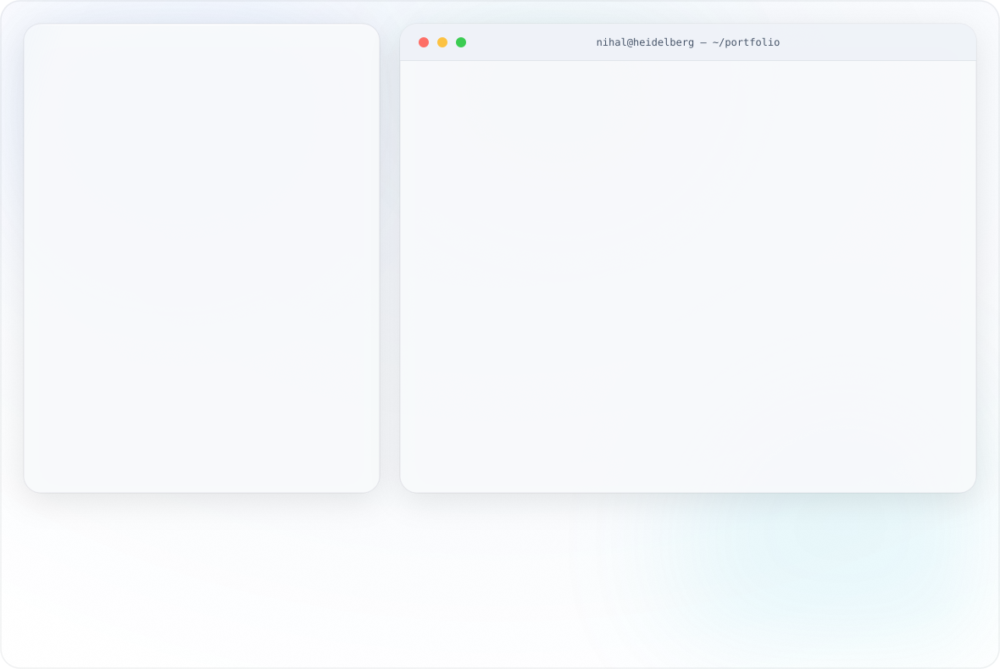

<a href="https://ai-agent-lufthansa-airlines.streamlit.app/">

<picture>

<source 
media="(prefers-color-scheme: dark)"
srcset="assets/dark.svg">

</picture>

</a>

  

&nbsp;

&nbsp;

  

---

🔗 Repository:
https://github.com/Nihalpujari/ML_Practice

---

## 🛠 Skills

Python • Machine Learning • Deep Learning • RAG • LangChain • Flask • SQL • Git
